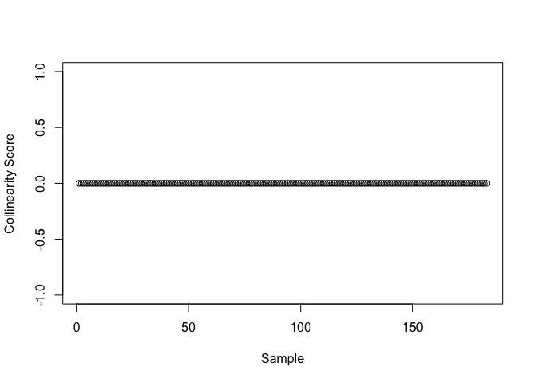
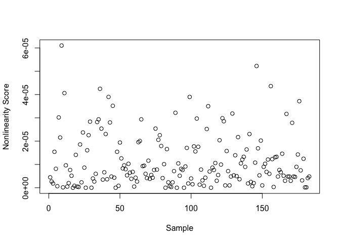

# Betadiag

Diagnostics and Remedy Tools for Beta Diversity Analysis

Betadiag is an R package designed to diagnose, evaluate, and correct
issues in beta diversity analysis, particularly when working with
dissimilarity matrices from ecological and microbiome studies. It
provides tools to assess matrix properties, perform ordination and
statistical evaluation, and apply remedies to ensure valid analysis.

## Installation

To install the development version of Betadiag from GitHub:

``` r
# Install devtools if not already installed
# install.packages("devtools")
library(devtools)
devtools::install_github("bioscinema/Betadiag")
library(Betadiag)
```

You can also use **Betadiag** through our [web-based Shiny
app](https://yiqianzhang.shinyapps.io/Betadiag/).  
Simply upload or paste your distance matrix and metadata to run
diagnostics directly in your browser — no installation needed, and no
data is saved.

## Key Features

- Check whether dissimilarity matrices are metric and Euclidean
- Assess triangle inequality violations, collinearity, and nonlinearity
- Convert dissimilarity matrices into Gram matrices
- Perform Principal Coordinate Analysis (PCoA) and eigenvalue
  decomposition
- Conduct PERMANOVA and pseudo R² analysis for association testing
- Apply Higham or Tikhonov corrections to enforce positive
  semi-definiteness
- Compute weighted UniFrac distances directly from phyloseq objects

## End-to-end demo: weighted UniFrac on IBD 16S data

``` r
# Install Betadiag (dev) and dependencies ---------------------------------
# install.packages("devtools")
library(devtools)
devtools::install_github("bioscinema/Betadiag")
```

    ## Using GitHub PAT from the git credential store.

    ## Skipping install of 'Betadiag' from a github remote, the SHA1 (bf9bbd2c) has not changed since last install.
    ##   Use `force = TRUE` to force installation

``` r
library(Betadiag)
library(phyloseq)
library(ggplot2)

# Load dataset ------------------------------------------------------------
load("RealData/IBD_16s_data_V4.RData")

# ---- Data cleaning ------------------------------------------------------
sample_data <- sample_data(phy1)
rows_with_na <- apply(
  sample_data[, c(1, 18, 50, 57, 115, 126, 127)],
  1,
  function(x) any(x %in% c("not providednot provided",
                           "-88",
                           "not provided",
                           "cd (from uc 7/17/2018)"))
)
physeq <- prune_samples(!rows_with_na, phy1)

metadata <- data.frame(
  diagnosis         = as.factor(physeq@sam_data$diagnosis),
  age_at_diagnosis  = as.numeric(physeq@sam_data$age_at__diagnosis),
  host_age          = as.numeric(physeq@sam_data$host_age),
  host_height       = as.numeric(physeq@sam_data$host_height),
  race              = physeq@sam_data$race,
  sex               = as.numeric(ifelse(physeq@sam_data$sex == "male", 1, 0)),
  smoking           = as.numeric(ifelse(physeq@sam_data$smoking == "n", 0, 1))
)

# ---- Diagnostics --------------------------------------------------------
wu_dist   <- phyloseq::distance(physeq, method = "wunifrac")
wu_matrix <- as.matrix(wu_dist)

wu.check <- check_distance(wu_matrix)
wu.check$is.metric
```

    ## [1] 0

``` r
wu.check$is.Euclidean
```

    ## [1] 0

``` r
wu.check$FNI
```

    ## [1] 0.1180882

``` r
plot(wu.check$collinearity.score,xlab = "Sample",ylab = "Collinearity Score") 
```

<!-- -->

Collinearity plot – Every point sits at ≈ −1, meaning each sample’s
distance vector is almost perfectly anti-parallel to the average vector.
In practice, this indicates very little pairwise collinearity, so
angle-preserving (metric) ordinations shouldn’t be distorted by
redundant information.

``` r
plot(wu.check$nonlinearity.score,xlab = "Sample",ylab = "Nonlinearity Score") 
```

<!-- -->

Non-linearity plot – Scores vary widely, with several pronounced spikes,
showing substantial non-linear distortion across samples. Linear methods
such as classical PCoA may mis-represent true relationships; non-linear
embeddings (t-SNE, UMAP) or a PSD remedy are advisable before
interpretation.

``` r
# ---- Baseline evaluation ------------------------------------------------
wu.evalution <- evaluate_beta(
  wu_matrix,
  as.data.frame(metadata[, 1]),  # Y
  as.data.frame(metadata[, -1]), # Z
  metadata
)
wu.evalution$PCo1.rate
```

    ## [1] 0.1474114

``` r
wu.evalution$PCo2.rate
```

    ## [1] 0.08727701

``` r
wu.evalution$PCoA.valid
```

    ## [1] FALSE

``` r
wu.evalution$pseudo_F
```

    ## [1] 0.9864256

``` r
wu.evalution$pseudo_R2
```

    ## [1] 0.07595821

``` r
wu.evalution$permanova_p
```

    ## [1] 0.4884885

``` r
wu.evalution$MiRKAT_R2
```

    ## [1] 0.01034452

``` r
# ---- Remedies -----------------------------------------------------------
# Higham projection
wu.higham           <- remedy_gram(wu_matrix, method = "Higham")
wu.higham.evalution <- evaluate_beta_gram(
  wu.higham,
  as.data.frame(metadata[, 1]),
  as.data.frame(metadata[, -1]),
  metadata
)
wu.higham.evalution$PCo1.rate
```

    ## [1] 0.1671499

``` r
wu.higham.evalution$PCo2.rate
```

    ## [1] 0.09896342

``` r
wu.higham.evalution$PCoA.valid
```

    ## [1] TRUE

``` r
wu.higham.evalution$pseudo_F
```

    ## [1] 1.113382

``` r
wu.higham.evalution$pseudo_R2
```

    ## [1] 0.08490423

``` r
wu.higham.evalution$permanova_p
```

    ## [1] 0.2072072

``` r
wu.higham.evalution$MiRKAT_R2
```

    ## [1] 0.01202306

``` r
wu.higham.euclidean <- euclidean_check(wu.higham)
wu.higham.euclidean
```

    ## $FNI
    ## [1] 0
    ## 
    ## $is.Euclidean
    ## [1] 1

``` r
# Tikhonov ridge (ε = 0)
wu.tik           <- remedy_gram(wu_matrix, method = "Tikhonov", epsilon = 0)
wu.tik.evalution <- evaluate_beta_gram(
  wu.tik,
  as.data.frame(metadata[, 1]),
  as.data.frame(metadata[, -1]),
  metadata
)
wu.tik.evalution$PCo1.rate
```

    ## [1] 0.01749814

``` r
wu.tik.evalution$PCo2.rate
```

    ## [1] 0.01244613

``` r
wu.tik.evalution$PCoA.valid
```

    ## [1] TRUE

``` r
wu.tik.evalution$pseudo_F
```

    ## [1] 1.069095

``` r
wu.tik.evalution$pseudo_R2
```

    ## [1] 0.08180331

``` r
wu.tik.evalution$permanova_p
```

    ## [1] 0.3753754

``` r
wu.tik.evalution$MiRKAT_R2
```

    ## [1] 0.005982887

``` r
wu.tik.euclidean <- euclidean_check(wu.tik)
wu.tik.euclidean
```

    ## $FNI
    ## [1] 0
    ## 
    ## $is.Euclidean
    ## [1] 1

``` r
# ---- Quick comparison table --------------------------------------------
data.frame(
  Matrix      = c("Raw", "Higham", "Tikhonov"),
  Euclidean   = c(wu.check$is.Euclidean,
                  wu.higham.euclidean$is.Euclidean,
                  wu.tik.euclidean$is.Euclidean),
  Pseudo_R2   = c(wu.evalution$pseudo_R2,
                  wu.higham.evalution$pseudo_R2,
                  wu.tik.evalution$pseudo_R2),
  PERM_pval   = c(wu.evalution$permanova_p,
                  wu.higham.evalution$permanova_p,
                  wu.tik.evalution$permanova_p)
)
```

    ##     Matrix Euclidean  Pseudo_R2 PERM_pval
    ## 1      Raw         0 0.07595821 0.4884885
    ## 2   Higham         1 0.08490423 0.2072072
    ## 3 Tikhonov         1 0.08180331 0.3753754
