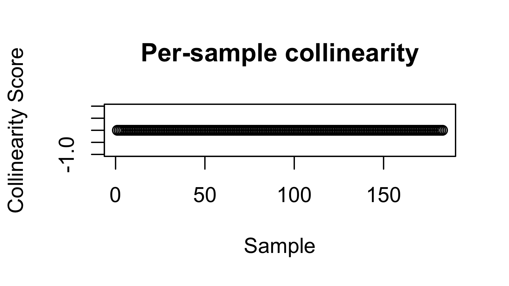

# Betadiag

Diagnostics and Remedy Tools for Beta Diversity Analysis

Betadiag is an R package designed to diagnose, evaluate, and correct issues in beta diversity analysis, particularly when working with dissimilarity matrices from ecological and microbiome studies. It provides tools to assess matrix properties, perform ordination and statistical evaluation, and apply remedies to ensure valid analysis.

## Installation

To install the development version of Betadiag from GitHub:

```r
# Install devtools if not already installed
install.packages("devtools")
library(devtools)
devtools::install_github("bioscinema/Betadiag")
library(Betadiag)
```

## Key Features

- Check whether dissimilarity matrices are metric and Euclidean
- Assess triangle inequality violations, collinearity, and nonlinearity
- Convert dissimilarity matrices into Gram matrices
- Perform Principal Coordinate Analysis (PCoA) and eigenvalue decomposition
- Conduct PERMANOVA and pseudo R² analysis for association testing
- Apply Higham or Tikhonov corrections to enforce positive semi-definiteness
- Compute weighted UniFrac distances directly from phyloseq objects

## End-to-end demo: weighted UniFrac on IBD 16S data

<details>
<summary>Click to expand full script</summary>

```r
# Install Betadiag (dev) and dependencies ---------------------------------
install.packages("devtools")
library(devtools)
devtools::install_github("bioscinema/Betadiag")

library(Betadiag)
library(phyloseq)
library(ggplot2)

# Load dataset ------------------------------------------------------------
load("RealData/IBD_16s_data_V4.RData")

# ---- Data cleaning ------------------------------------------------------
sample_data <- sample_data(phy1)
rows_with_na <- apply(
  sample_data[, c(1, 18, 50, 57, 115, 126, 127)],
  1,
  function(x) any(x %in% c("not providednot provided",
                           "-88",
                           "not provided",
                           "cd (from uc 7/17/2018)"))
)
physeq <- prune_samples(!rows_with_na, phy1)

metadata <- data.frame(
  diagnosis         = as.factor(physeq@sam_data$diagnosis),
  age_at_diagnosis  = as.numeric(physeq@sam_data$age_at__diagnosis),
  host_age          = as.numeric(physeq@sam_data$host_age),
  host_height       = as.numeric(physeq@sam_data$host_height),
  race              = physeq@sam_data$race,
  sex               = as.numeric(ifelse(physeq@sam_data$sex == "male", 1, 0)),
  smoking           = as.numeric(ifelse(physeq@sam_data$smoking == "n", 0, 1))
)

# ---- Diagnostics --------------------------------------------------------
wu_dist   <- phyloseq::distance(physeq, method = "wunifrac")
wu_matrix <- as.matrix(wu_dist)

wu.check <- check_distance(wu_matrix)
wu.check
```

```text
$is.metric
[1] 0

$is.Euclidean
[1] 0

$collinearity.score
  [1] 0 0 0 0 0 0 0 0 0 0 0 0 0 0 0 0 0 0 0 0 0 0 0 0 0 0 0 0 0 0 0 0 0 0 0 0 0 0 0 0 0 0
 [43] 0 0 0 0 0 0 0 0 0 0 0 0 0 0 0 0 0 0 0 0 0 0 0 0 0 0 0 0 0 0 0 0 0 0 0 0 0 0 0 0 0 0
 [85] 0 0 0 0 0 0 0 0 0 0 0 0 0 0 0 0 0 0 0 0 0 0 0 0 0 0 0 0 0 0 0 0 0 0 0 0 0 0 0 0 0 0
[127] 0 0 0 0 0 0 0 0 0 0 0 0 0 0 0 0 0 0 0 0 0 0 0 0 0 0 0 0 0 0 0 0 0 0 0 0 0 0 0 0 0 0
[169] 0 0 0 0 0 0 0 0 0 0 0 0 0 0 0

$nonlinearity.score
  [1] 4.478811e-06 2.654110e-06 1.824701e-06 1.542701e-05 8.128212e-06 6.635275e-07
  [7] 3.019050e-05 2.156464e-05 6.104453e-05 1.658819e-07 4.064106e-05 9.621149e-06
 [13] 4.976456e-07 1.990583e-06 7.630566e-06 5.142338e-06 0.000000e+00 8.294094e-07
 [19] 1.409996e-05 4.976456e-07 3.317638e-07 1.857877e-05 2.322346e-06 2.372111e-05
 [25] 8.625858e-06 0.000000e+00 1.609054e-05 2.255994e-05 2.836580e-05 0.000000e+00
 [31] 3.981165e-06 2.654110e-06 5.971748e-06 2.819992e-05 2.936109e-05 4.246576e-05
 [37] 2.537993e-05 3.483519e-06 6.635275e-06 2.305758e-05 3.649401e-06 3.898224e-05
 [43] 2.803404e-05 4.810575e-06 3.516696e-05 4.312929e-06 0.000000e+00 1.542701e-05
 [49] 8.294094e-07 1.940818e-05 1.260702e-05 8.294094e-06 9.621149e-06 7.962330e-06
 [55] 5.308220e-06 1.028468e-05 6.469393e-06 3.815283e-06 6.801157e-06 4.976456e-07
 [61] 4.312929e-06 2.654110e-06 1.957406e-05 2.007171e-05 2.936109e-05 9.289385e-06
 [67] 9.455267e-06 5.971748e-06 4.147047e-06 1.161173e-05 3.815283e-06 5.474102e-06
 [73] 4.312929e-06 7.630566e-06 2.537993e-05 7.796448e-06 2.056935e-05 2.255994e-05
 [79] 1.791524e-05 4.147047e-06 1.011879e-05 0.000000e+00 1.658819e-05 2.322346e-06
 [85] 6.635275e-07 3.317638e-07 2.322346e-06 7.132921e-06 3.218108e-05 0.000000e+00
 [91] 1.045056e-05 5.142338e-06 8.128212e-06 7.630566e-06 0.000000e+00 9.123503e-06
 [97] 1.708583e-05 1.824701e-06 3.898224e-05 3.981165e-06 1.492937e-06 1.774936e-05
[103] 1.559290e-05 2.969286e-05 1.758348e-05 1.327055e-06 7.796448e-06 3.151756e-06
[109] 8.294094e-07 4.312929e-06 2.521405e-05 3.500108e-05 6.967039e-06 0.000000e+00
[115] 8.625858e-06 7.630566e-06 1.061644e-05 2.985874e-06 5.474102e-06 2.040347e-05
[121] 9.952913e-06 2.985874e-05 2.853168e-05 9.952913e-07 1.575878e-05 7.132921e-06
[127] 9.952913e-07 4.810575e-06 3.184932e-05 5.308220e-06 1.393408e-05 4.976456e-06
[133] 2.173053e-05 3.649401e-06 1.045056e-05 1.210938e-05 1.327055e-05 8.957621e-06
[139] 1.642231e-05 1.824701e-06 2.305758e-05 2.488228e-06 6.635275e-07 1.990583e-06
[145] 1.078232e-05 5.225279e-05 1.691995e-05 5.308220e-06 2.023759e-05 9.952913e-07
[151] 8.957621e-06 1.028468e-05 6.801157e-06 1.210938e-05 5.971748e-06 4.362693e-05
[157] 1.227526e-05 3.317638e-07 1.310467e-05 1.327055e-05 4.810575e-06 7.630566e-06
[163] 6.635275e-06 1.459761e-05 5.142338e-06 2.985874e-06 3.168344e-05 4.810575e-06
[169] 4.810575e-06 2.985874e-06 2.786816e-05 4.810575e-06 4.644693e-06 8.957621e-06
[175] 1.426584e-05 3.715754e-05 7.464685e-06 3.151756e-06 1.244114e-05 1.658819e-07
[181] 1.658819e-07 4.147047e-06 4.810575e-06

$FNI
[1] 0.1180882
```
```r
lot(wu.check$collinearity.score,xlab = "Sample",ylab = "Collinearity Score") 
plot(wu.check$nonlinearity.score,xlab = "Sample",ylab = "Nonlinearity Score") 
```


Collinearity plot – Every point sits at ≈ −1, meaning each sample’s distance vector is almost perfectly anti-parallel to the average vector. In practice, this indicates very little pairwise collinearity, so angle-preserving (metric) ordinations shouldn’t be distorted by redundant information.


Non-linearity plot – Scores vary widely, with several pronounced spikes, showing substantial non-linear distortion across samples. Linear methods such as classical PCoA may mis-represent true relationships; non-linear embeddings (t-SNE, UMAP) or a PSD remedy are advisable before interpretation.
```r
# ---- Baseline evaluation ------------------------------------------------
wu.evalution <- evaluate_beta(
  wu_matrix,
  as.data.frame(metadata[, 1]),  # Y
  as.data.frame(metadata[, -1]), # Z
  metadata
)
wu.evalution
```

```text
$eigenvalues
  [1]  2.097874e-02  1.242076e-02  8.922932e-03  7.736877e-03  4.704721e-03  4.244320e-03
  [7]  4.028030e-03  3.341746e-03  3.056445e-03  2.928168e-03  2.762241e-03  2.694468e-03
 [13]  2.427490e-03  2.173529e-03  2.046541e-03  1.836456e-03  1.752206e-03  1.698149e-03
 [19]  1.608685e-03  1.487595e-03  1.394336e-03  1.325872e-03  1.277541e-03  1.180462e-03
 [25]  1.144515e-03  1.070106e-03  1.019943e-03  9.889121e-04  9.672023e-04  9.033839e-04
 [31]  8.670073e-04  8.302349e-04  7.989392e-04  7.764444e-04  7.414777e-04  7.270138e-04
 [37]  6.883558e-04  6.432175e-04  6.110913e-04  6.058676e-04  5.751601e-04  5.552583e-04
 [43]  5.406698e-04  5.065617e-04  5.026020e-04  4.656222e-04  4.627540e-04  4.550388e-04
 [49]  4.179902e-04  4.136664e-04  3.976113e-04  3.939649e-04  3.688090e-04  3.607039e-04
 [55]  3.461421e-04  3.366104e-04  3.112536e-04  3.070341e-04  2.954969e-04  2.866365e-04
 [61]  2.789646e-04  2.647671e-04  2.558151e-04  2.520540e-04  2.383697e-04  2.313825e-04
 [67]  2.207157e-04  2.059626e-04  1.949608e-04  1.929011e-04  1.852575e-04  1.822999e-04
 [73]  1.694541e-04  1.678623e-04  1.569097e-04  1.470955e-04  1.441318e-04  1.351072e-04
 [79]  1.308755e-04  1.256428e-04  1.183382e-04  1.172344e-04  1.120231e-04  1.103815e-04
 [85]  1.052742e-04  1.011718e-04  9.554262e-05  9.372426e-05  8.423936e-05  8.407854e-05
 [91]  7.517586e-05  7.352459e-05  6.610987e-05  6.525092e-05  6.326521e-05  5.891420e-05
 [97]  5.411252e-05  5.031660e-05  4.844826e-05  4.329396e-05  4.242611e-05  3.666277e-05
[103]  3.539568e-05  3.332323e-05  2.903783e-05  2.358561e-05  2.178157e-05  2.130161e-05
[109]  1.805988e-05  1.030661e-05  9.219135e-06  7.593934e-06  4.190008e-06  2.282541e-06
[115]  8.298695e-07  0.000000e+00 -5.329114e-07 -2.502606e-06 -3.689426e-06 -6.352402e-06
[121] -8.355060e-06 -1.032567e-05 -1.244907e-05 -1.438684e-05 -1.535459e-05 -1.593054e-05
[127] -2.004608e-05 -2.155447e-05 -2.513199e-05 -2.787702e-05 -3.052043e-05 -3.203829e-05
[133] -3.313495e-05 -3.493934e-05 -3.597803e-05 -4.354737e-05 -4.437159e-05 -4.557933e-05
[139] -4.856418e-05 -5.175830e-05 -5.428161e-05 -5.493355e-05 -5.978804e-05 -6.352037e-05
[145] -6.443857e-05 -6.791348e-05 -7.230788e-05 -7.355791e-05 -7.851192e-05 -8.191757e-05
[151] -8.415700e-05 -8.736791e-05 -9.235539e-05 -9.449545e-05 -9.580703e-05 -9.883455e-05
[157] -1.084948e-04 -1.107827e-04 -1.169301e-04 -1.221466e-04 -1.265029e-04 -1.345324e-04
[163] -1.374044e-04 -1.417598e-04 -1.490416e-04 -1.513537e-04 -1.647736e-04 -1.678424e-04
[169] -1.725282e-04 -1.807160e-04 -1.980617e-04 -2.056117e-04 -2.153491e-04 -2.426948e-04
[175] -2.554223e-04 -2.739836e-04 -2.900494e-04 -3.351265e-04 -3.728982e-04 -4.839137e-04
[181] -6.431548e-04 -8.327431e-04 -8.662695e-03

$scores
                [,1]          [,2]          [,3]          [,4]          [,5]
  [1,]  6.847667e-03  6.843490e-03 -7.484164e-04 -5.010948e-03 -5.664716e-04
  [2,] -2.526277e-03  4.370687e-03 -2.125168e-03  1.435332e-03  6.547884e-04
  [3,] -5.773212e-03 -1.451856e-03  1.349099e-03  4.871398e-03  2.391423e-03
  [4,]  2.225796e-02 -1.404601e-02 -1.276412e-03  3.300150e-03 -1.687810e-03
  [5,] -4.130781e-03 -4.271247e-03  1.280926e-02 -9.635360e-04 -5.367937e-03
  [6,] -3.963387e-03  2.978579e-03  1.035943e-03  1.117808e-02  3.345521e-03
  [7,] -1.933821e-02 -1.161039e-02  2.840125e-03 -3.114163e-03  1.517332e-03
  [8,] -3.463568e-03 -5.359838e-04 -2.667900e-03  2.889576e-03 -1.230870e-03
                [,6]          [,7]          [,8]          [,9]         [,10]
  [1,] -9.331958e-03  3.018780e-04  6.721139e-03  6.021354e-03  1.512173e-03
  [2,]  1.366703e-03 -3.697862e-03  5.158409e-05  4.402412e-04  5.958209e-04
  [3,]  1.855961e-04 -7.428297e-04  1.326160e-03 -5.878039e-04  8.529626e-04
  [4,] -2.594163e-03  1.889161e-03 -6.057452e-03 -2.596376e-03  6.284750e-04
  [5,]  3.092789e-03  2.770570e-03 -1.274078e-03  2.426130e-03  2.122180e-04
  [6,] -7.260520e-04  2.110742e-03  2.214143e-03 -1.103238e-03 -2.502382e-04
  [7,]  3.736816e-03  7.230051e-04 -3.895736e-05 -6.778385e-04 -1.910393e-03
  [8,]  9.777222e-04 -3.534903e-03 -1.238125e-03  5.941456e-04  3.068168e-03
               [,11]         [,12]         [,13]         [,14]         [,15]
  [1,] -1.806869e-03 -3.648070e-03  5.158107e-03 -2.420561e-03 -8.703238e-04
  [2,] -5.196009e-05  2.155571e-03 -2.124104e-03 -2.047155e-03 -1.240985e-04
  [3,] -3.508322e-04  2.163549e-03  1.500769e-03  1.732653e-03 -1.165963e-03
  [4,]  9.550393e-03  3.039328e-03 -2.392649e-03 -7.889877e-04 -2.230287e-03
  [5,]  4.721147e-03  8.051979e-03  4.574736e-03 -1.884495e-03 -2.263405e-03
  [6,] -1.093482e-03  7.327093e-04 -1.435483e-04  8.339620e-04 -7.843284e-04
  [7,] -2.293315e-03 -3.830195e-03  1.620844e-03  2.427813e-03  5.529982e-04
  [8,]  3.039273e-03  1.857827e-03 -1.834641e-03  3.586435e-03  2.990382e-03
               [,16]         [,17]         [,18]         [,19]         [,20]
  [1,] -1.273334e-03 -4.448479e-03  1.780295e-03  1.581333e-03 -6.148491e-04
  [2,] -7.667338e-04 -1.803786e-03 -4.208121e-04  2.396520e-03 -4.267470e-03
  [3,]  2.218570e-04 -1.237339e-03 -3.808693e-04  8.017162e-04 -2.132551e-03
  [4,]  4.318028e-03  3.997742e-03  3.116968e-03 -2.023452e-03 -1.044022e-03
  [5,]  6.777450e-04  3.701923e-03  4.296089e-03  6.269673e-03  3.938361e-03
  [6,]  1.334785e-03 -2.110397e-03 -1.657864e-03  3.069260e-04 -6.800365e-04
  [7,]  2.401030e-03 -1.096951e-04  9.324988e-04  5.518028e-04 -4.756306e-04
  [8,]  1.855041e-03  6.579358e-03  1.280315e-03 -8.924234e-03 -5.591313e-03
               [,21]         [,22]         [,23]         [,24]         [,25]
  [1,] -3.247921e-04 -2.521725e-03 -2.963513e-03  8.839526e-04 -2.491056e-03
  [2,]  1.773001e-03 -6.886155e-04 -1.588777e-03 -3.542122e-03 -1.956840e-03
  [3,] -1.111703e-03 -6.231970e-04 -3.342891e-04  1.376993e-03 -1.233295e-03
  [4,]  2.935943e-03 -1.714220e-03  9.754598e-04 -1.373459e-03 -1.955021e-03
  [5,]  2.334844e-03 -1.232751e-03 -8.371291e-03  1.513736e-03  2.636275e-03
  [6,] -1.135880e-03 -5.485254e-06  2.230468e-03 -2.509319e-04 -2.201637e-03
  [7,] -1.070105e-04 -2.904067e-04  7.553116e-04 -1.240016e-03 -5.063881e-04
  [8,]  1.609342e-03 -8.865078e-03  5.470302e-04 -1.646317e-03  4.250117e-03
               [,26]         [,27]         [,28]         [,29]         [,30]
  [1,]  2.587791e-03 -3.096602e-03  8.870211e-04 -5.660464e-04  3.182546e-03
  [2,] -1.310763e-03 -3.759011e-03  1.667151e-03  1.924401e-03  1.918455e-03
  [3,] -1.085332e-03 -2.591856e-03 -8.483546e-04  1.146722e-03 -6.853355e-04
  [4,]  1.637652e-03 -1.906638e-03  1.923973e-03 -2.623479e-03  1.872545e-03
  [5,]  6.027051e-03  2.113385e-04  7.796330e-04  1.023070e-03  4.012753e-04
  [6,]  1.459011e-03 -9.283937e-04 -1.237786e-03  1.993948e-03 -1.223021e-03
  [7,] -2.910524e-05  1.581617e-03 -1.295363e-03 -4.142028e-04  8.750431e-04
  [8,]  4.861672e-03 -9.642952e-04 -2.277025e-03 -1.245237e-04  1.359399e-04
               [,31]         [,32]         [,33]         [,34]         [,35]
  [1,] -2.175442e-03  1.290406e-03 -1.569720e-03 -3.324590e-03 -1.744835e-03
  [2,] -9.691466e-05  7.843685e-04 -6.840236e-03  9.216019e-04 -2.677566e-03
  [3,]  3.344748e-05  1.364561e-03  1.674522e-04  1.170160e-04  1.036774e-04
  [4,] -4.133298e-03 -1.474457e-03 -5.919058e-04  8.920374e-04 -2.409674e-03
  [5,]  1.200520e-04  2.846630e-03  2.294882e-03  4.662063e-04  2.653683e-03
  [6,] -1.198215e-03  1.456778e-03  4.079962e-04  7.558488e-06 -3.468966e-04
  [7,] -9.151540e-04  1.870547e-03  9.317692e-04  2.625556e-03  1.126471e-03
  [8,] -2.136173e-03 -1.182533e-03 -1.771407e-03 -1.749801e-03  1.182515e-03
               [,36]         [,37]         [,38]         [,39]         [,40]
  [1,] -4.231497e-03 -4.699515e-03 -3.362949e-04  1.678343e-03 -1.457124e-03
  [2,] -1.660868e-03 -7.049708e-03 -2.074155e-03 -1.185119e-03 -1.431227e-03
  [3,]  8.959532e-04 -1.316442e-04  5.704388e-04 -3.076338e-04  5.803082e-04
  [4,]  2.662781e-03 -6.647476e-04 -8.087995e-04 -5.245346e-04 -1.491446e-03
  [5,]  4.154702e-04  1.862122e-03  1.311736e-03 -3.907885e-04  2.379763e-03
  [6,]  1.364043e-03 -3.557693e-05  1.327479e-03 -3.923879e-04 -8.852759e-04
  [7,]  1.905231e-03 -6.601809e-04 -6.315666e-04  3.584027e-03 -1.610596e-03
  [8,]  1.224539e-04  7.099992e-04 -7.786744e-04 -3.329357e-03  3.739585e-03
               [,41]         [,42]         [,43]         [,44]         [,45]
  [1,]  4.447619e-04  3.055551e-03 -4.237755e-03  2.336367e-03 -2.269202e-03
  [2,]  1.860757e-03 -6.355423e-04 -3.710994e-03  9.079443e-04  2.546551e-03
  [3,]  3.999267e-05 -9.376513e-04 -6.997849e-04  6.818986e-05 -2.727580e-04
  [4,] -9.074657e-04  1.282307e-03  6.550271e-04  1.371096e-03  5.436382e-04
  [5,]  1.563089e-03  1.821571e-03  1.349333e-03  7.907541e-04 -1.165736e-03
  [6,] -8.418461e-05 -2.095711e-03  1.466416e-03 -7.375680e-04  2.197747e-04
  [7,]  3.653748e-04  2.009391e-03 -3.221962e-03 -7.081967e-04  4.230632e-03
  [8,] -3.033912e-04 -1.044834e-03 -2.415157e-03  1.538606e-03  2.922187e-03
               [,46]         [,47]         [,48]         [,49]         [,50]
  [1,]  1.703396e-03 -2.415842e-03 -1.354682e-03  6.313029e-04  2.698129e-03
  [2,]  2.948972e-03 -1.793872e-04  7.382157e-04 -2.391849e-03 -1.444949e-04
  [3,]  1.099480e-03  2.047676e-03 -1.696971e-03 -4.957930e-04  3.209525e-04
  [4,] -8.457270e-04 -2.349119e-04  1.275138e-03  2.732229e-03  8.166388e-04
  [5,]  6.841258e-05 -9.963270e-04  1.222604e-03  1.901653e-04  1.221126e-03
  [6,] -1.590653e-03  1.063601e-03 -1.661620e-03  2.878149e-04  7.575122e-04
  [7,] -1.026859e-03 -2.209779e-03  1.717083e-04 -4.873329e-05  3.093383e-03
  [8,] -1.006566e-03  3.883170e-03 -5.561344e-04  1.426910e-03 -4.675725e-04
               [,51]         [,52]         [,53]         [,54]         [,55]
  [1,]  2.492955e-03 -1.948259e-03  2.247117e-04  1.523422e-03  4.429360e-04
  [2,]  3.649845e-03 -5.663661e-03  3.018509e-04 -4.429372e-04  2.575477e-03
  [3,]  3.047299e-04 -5.718136e-04  1.287368e-04 -2.196708e-03  5.504808e-04
  [4,] -7.671297e-04  1.731053e-03 -1.016514e-03  8.948548e-04 -7.633435e-04
  [5,]  1.857952e-03  3.011669e-03 -8.326898e-04 -2.248544e-04 -1.645150e-03
  [6,]  1.852395e-04  6.290926e-04  1.011425e-03 -1.143475e-03  1.283745e-03
  [7,]  1.043690e-03 -1.479577e-03 -4.388268e-03 -7.204253e-04 -7.368898e-04
  [8,]  1.639143e-03 -1.039309e-03 -9.151841e-04 -5.825545e-04  8.951925e-04
               [,56]         [,57]         [,58]         [,59]         [,60]
  [1,] -1.031618e-03  1.253487e-03 -1.072630e-03  2.603908e-04  2.090642e-03
  [2,] -4.082938e-03 -1.599934e-03  4.687988e-03  1.551652e-03  4.829462e-04
  [3,] -3.197473e-04  1.256960e-03  5.007073e-04  1.624433e-03  8.611792e-04
  [4,] -3.773335e-04 -5.908619e-04  1.629355e-03 -1.476413e-03  7.013178e-04
  [5,] -6.082009e-04  7.327297e-04  6.431960e-04 -9.027820e-04 -2.652165e-04
  [6,] -1.520472e-04 -6.148238e-05  5.556759e-04 -7.294982e-04 -7.472538e-04
  [7,]  4.540574e-04 -8.336384e-04 -3.341897e-03  2.125080e-04 -1.981488e-03
  [8,]  1.095901e-03 -2.916305e-04 -2.076096e-03  4.430644e-04 -1.077994e-03
               [,61]         [,62]         [,63]         [,64]         [,65]
  [1,]  2.927603e-03  1.930651e-03 -1.573400e-03  1.064034e-03 -2.421897e-04
  [2,] -3.647526e-03 -2.484609e-03  2.716926e-03  3.842482e-04  1.737025e-03
  [3,]  1.191370e-03  1.359323e-03  2.357663e-04 -2.145683e-04 -1.845467e-03
  [4,] -9.515247e-04 -1.368991e-03 -6.992425e-04  4.031559e-04 -4.271746e-04
  [5,] -8.736684e-04 -1.234567e-03 -6.776494e-05  1.164208e-04 -2.755696e-04
  [6,] -1.068418e-03  9.048738e-04 -2.971437e-04  3.171857e-04 -5.747785e-04
  [7,]  2.687049e-03 -5.618980e-03 -1.424505e-03  1.879199e-04  5.236948e-04
  [8,]  1.039229e-03  2.432629e-03 -2.952675e-04  9.480860e-04  2.591739e-03
               [,66]         [,67]         [,68]         [,69]         [,70]
  [1,]  1.460223e-03 -6.969112e-06 -2.784839e-04 -1.925476e-03 -5.972230e-04
  [2,] -2.835443e-03 -1.675036e-04  1.318636e-03  2.037805e-04 -1.197103e-03
  [3,] -2.291299e-03 -1.742727e-03  1.255865e-03 -1.312330e-03 -2.205191e-03
  [4,] -6.715671e-04  8.921016e-04  4.701946e-04 -5.942199e-04 -6.678574e-04
  [5,] -1.517639e-03 -5.078759e-04 -1.536801e-03 -3.574515e-04 -5.349689e-04
  [6,]  3.580349e-04 -1.619318e-05  1.141794e-03 -6.615629e-04 -1.536107e-04
  [7,] -1.265573e-03 -7.585577e-04 -8.187452e-04  1.090134e-03 -9.199851e-04
  [8,] -1.329221e-04  4.470316e-04 -1.180110e-03  1.544146e-03  7.162846e-04
               [,71]         [,72]         [,73]         [,74]         [,75]
  [1,] -3.214783e-04 -8.220658e-06  2.426166e-04 -9.266956e-04 -1.290407e-03
  [2,] -1.266507e-03  1.639294e-03  3.002856e-04 -1.041098e-04  1.313813e-05
  [3,] -5.689905e-05 -5.383656e-04  1.190935e-03  1.740212e-03 -2.771566e-04
  [4,]  9.112787e-04  1.045628e-03  2.565443e-04 -1.937998e-03 -9.274506e-04
  [5,] -1.578041e-04  1.882976e-03 -1.233238e-04 -1.256800e-05 -1.361262e-04
  [6,]  7.319124e-04  1.172368e-03  1.141110e-03  3.272284e-04 -2.969311e-04
  [7,] -1.014557e-03  1.769482e-03  1.012877e-03  1.261612e-03  5.288638e-04
  [8,]  6.088825e-04  1.246483e-04  5.366858e-04 -1.678252e-03 -2.547668e-04
               [,76]         [,77]         [,78]         [,79]         [,80]
  [1,] -2.966559e-04 -3.673173e-04 -4.471587e-05  1.497344e-04 -3.578421e-04
  [2,] -5.429015e-04 -4.609285e-04 -1.560612e-03  9.097596e-04 -1.695056e-04
  [3,]  3.437191e-04  9.521633e-04  5.659347e-04  9.098781e-04 -7.047538e-05
  [4,]  1.082062e-03 -1.448931e-03  8.248419e-04  1.538451e-04  1.890590e-04
  [5,]  1.230654e-04 -1.550507e-04 -3.970983e-04  8.445373e-05  7.073767e-05
  [6,]  4.693230e-04  2.431142e-04  4.950943e-04  5.962347e-04  4.452489e-05
  [7,]  1.268367e-03  1.051051e-03  1.807285e-03 -1.586050e-03  2.868897e-04
  [8,]  2.115069e-04  2.926028e-04 -1.554033e-04  1.141823e-04  5.489970e-04
               [,81]         [,82]         [,83]         [,84]         [,85]
  [1,]  4.860813e-04 -7.045898e-05  3.767844e-04  2.168887e-03 -3.250946e-04
  [2,] -3.076991e-04  5.912953e-04  6.798660e-04 -2.003267e-04  9.105310e-04
  [3,]  6.695723e-04  7.735239e-04 -7.683644e-04  6.287180e-04 -1.722133e-06
  [4,]  3.706510e-04 -3.554028e-04  2.122942e-04  7.077790e-04  3.974845e-06
  [5,]  3.794043e-05 -1.583910e-04  9.165659e-04  8.415758e-05  8.055046e-05
  [6,]  2.167441e-04 -6.131648e-04  5.579762e-04 -7.062680e-05 -4.590921e-04
  [7,]  2.722199e-03  1.946785e-03 -7.440796e-05  3.263872e-04 -5.070586e-04
  [8,] -1.196060e-03 -6.568267e-04  4.161059e-04  2.330287e-04 -1.087417e-04
               [,86]         [,87]         [,88]         [,89]         [,90]
  [1,] -2.268806e-04 -7.302017e-04 -2.714182e-04 -4.991773e-04  5.023909e-04
  [2,]  5.292843e-04 -4.910122e-05  2.090191e-04  2.214631e-03 -1.065188e-04
  [3,]  2.165632e-04  1.077370e-03  7.983996e-04 -7.622045e-04 -2.775420e-04
  [4,] -9.538802e-04 -4.624648e-04  3.574147e-04  4.074570e-04  7.723439e-05
  [5,] -3.301557e-04 -5.257686e-04  1.979392e-04  4.592924e-04 -3.751387e-04
  [6,]  4.233078e-04  9.865231e-04 -4.110489e-04  1.287504e-04 -1.408969e-03
  [7,]  9.535537e-04  7.899148e-04 -8.550814e-04 -6.995110e-05 -8.992131e-04
  [8,]  1.034626e-04  1.691061e-04 -1.898158e-04  2.895526e-04 -3.359656e-05
               [,91]         [,92]         [,93]         [,94]         [,95]
  [1,]  3.439283e-04  6.193543e-04  1.212817e-03 -1.404263e-04  9.004711e-05
  [2,]  6.050298e-04 -5.813122e-04 -6.553264e-04  7.140849e-05  2.727610e-04
  [3,]  4.911155e-04  2.361736e-04 -3.158123e-04 -1.361767e-03 -1.976078e-04
  [4,] -1.021856e-03 -1.157149e-04 -2.378103e-04  1.056728e-04  7.641250e-05
  [5,]  6.087935e-04  1.748587e-04 -4.585979e-04 -3.023858e-04 -1.243130e-04
  [6,] -6.593277e-05 -1.127026e-04 -2.905348e-04 -1.732922e-04  5.393992e-04
  [7,]  6.975710e-04 -3.464109e-04  3.113764e-04  3.558174e-05  5.319831e-05
  [8,]  3.346739e-04 -3.413096e-04 -2.679504e-04 -3.823106e-04 -5.050726e-05
               [,96]         [,97]         [,98]         [,99]        [,100]
  [1,] -1.327014e-04 -4.102987e-04  5.257519e-04 -7.621671e-04 -8.235161e-05
  [2,]  4.459045e-04  4.055491e-04  3.955382e-04  9.269921e-04  4.370222e-04
  [3,] -1.076399e-03  8.574960e-04 -1.183534e-03  4.155979e-04  3.629409e-04
  [4,] -4.501054e-04 -5.830501e-04 -1.989610e-04  1.787565e-04 -3.552540e-04
  [5,]  5.020505e-04  5.867919e-04 -1.466124e-04 -1.662439e-04  4.935289e-04
  [6,] -7.829529e-05 -9.897710e-05  6.058161e-04 -3.955878e-04 -1.761304e-04
  [7,] -1.038655e-03 -1.137468e-04  7.293978e-04  5.016379e-04 -4.834847e-04
  [8,]  7.780596e-05  9.736878e-04  6.787281e-04  2.611095e-04 -6.402974e-05
              [,101]        [,102]        [,103]        [,104]        [,105]
  [1,]  5.257581e-05  4.682220e-04 -3.043902e-05 -4.585131e-04  1.485266e-05
  [2,]  9.432662e-05  1.292249e-04  4.146160e-04 -1.202722e-04 -3.794679e-04
  [3,] -2.898118e-04  6.696610e-05  9.844731e-05  1.007845e-03  2.061464e-04
  [4,]  1.880662e-05 -8.874598e-05 -1.567417e-04 -2.673169e-04  1.255590e-04
  [5,] -1.589748e-04 -6.236535e-05  6.773990e-04 -1.488980e-04  1.522022e-04
  [6,] -3.921505e-05  5.785330e-04 -3.371019e-04  3.095944e-04 -1.542916e-04
  [7,]  1.747653e-04  5.187519e-04 -4.756945e-04  6.307970e-04  3.234260e-04
  [8,]  8.068062e-05  2.573318e-04 -9.446725e-05  7.535896e-05  8.029451e-04
              [,106]        [,107]        [,108]        [,109]        [,110]
  [1,] -5.999435e-04  2.764496e-04 -3.539616e-04  2.462082e-04 -4.398886e-05
  [2,]  5.956319e-05 -8.082266e-05  7.696991e-05 -6.240833e-05  1.761517e-04
  [3,]  5.611497e-04 -1.224009e-04 -4.726808e-04 -5.721071e-04  1.654599e-04
  [4,]  3.118859e-04 -4.472673e-05 -1.949312e-04  4.536679e-05  1.260142e-04
  [5,]  4.583571e-04 -4.812444e-04 -2.814761e-04  1.672294e-04 -1.795062e-05
  [6,] -1.328582e-04  5.191295e-04  1.531854e-04  2.254568e-04 -1.600401e-04
  [7,] -3.318690e-04 -1.160005e-07  7.963036e-05 -2.165898e-04  7.845654e-05
  [8,] -5.233504e-04 -5.073338e-04  5.015573e-06 -4.777014e-05 -1.944964e-04
              [,111]        [,112]        [,113]        [,114]        [,115]
  [1,] -2.036308e-05 -1.963411e-04 -1.820931e-04 -9.378528e-05  3.654865e-05
  [2,] -4.228313e-05 -4.396685e-05  5.631791e-05  5.107122e-05 -2.584260e-05
  [3,]  2.858934e-04  1.099054e-04 -3.231234e-04 -2.292690e-04  1.810318e-05
  [4,]  1.868056e-04  1.403367e-04  5.056835e-05 -4.534089e-06  5.409019e-05
  [5,] -7.790844e-05 -1.528260e-04  8.508778e-05 -5.537883e-05 -4.578628e-06
  [6,]  6.278300e-05  1.071078e-04  3.446533e-05  3.428690e-05  5.124049e-05
  [7,] -9.078040e-05  4.062077e-05  1.871797e-04 -1.832783e-04  7.324058e-05
  [8,]  4.387624e-05 -8.663001e-05 -1.455251e-04  9.945337e-05  4.613724e-05
 [ reached 'max' / getOption("max.print") -- omitted 175 rows ]

$PCo1.rate
[1] 0.1474114

$PCo2.rate
[1] 0.08727701

$PCoA.valid
[1] FALSE

$pseudo_F
[1] 0.9864256

$pseudo_R2
[1] 0.07595821

$permanova_p
[1] 0.4964965

$MiRKAT_R2
[1] 0.01034452
```

```r
# ---- Remedies -----------------------------------------------------------
# Higham projection
wu.higham           <- remedy_gram(wu_matrix, method = "Higham")
wu.higham.evalution <- evaluate_beta_gram(
  wu.higham,
  as.data.frame(metadata[, 1]),
  as.data.frame(metadata[, -1]),
  metadata
)
wu.higham.evalution
```
```text
$eigenvalues
  [1] 2.097874e-02 1.242076e-02 8.922932e-03 7.736877e-03 4.704721e-03 4.244320e-03
  [7] 4.028030e-03 3.341746e-03 3.056445e-03 2.928168e-03 2.762241e-03 2.694468e-03
 [13] 2.427490e-03 2.173529e-03 2.046541e-03 1.836456e-03 1.752206e-03 1.698149e-03
 [19] 1.608685e-03 1.487595e-03 1.394336e-03 1.325872e-03 1.277541e-03 1.180462e-03
 [25] 1.144515e-03 1.070106e-03 1.019943e-03 9.889121e-04 9.672023e-04 9.033839e-04
 [31] 8.670073e-04 8.302349e-04 7.989392e-04 7.764444e-04 7.414777e-04 7.270138e-04
 [37] 6.883558e-04 6.432175e-04 6.110913e-04 6.058676e-04 5.751601e-04 5.552583e-04
 [43] 5.406698e-04 5.065617e-04 5.026020e-04 4.656222e-04 4.627540e-04 4.550388e-04
 [49] 4.179902e-04 4.136664e-04 3.976113e-04 3.939649e-04 3.688090e-04 3.607039e-04
 [55] 3.461421e-04 3.366104e-04 3.112536e-04 3.070341e-04 2.954969e-04 2.866365e-04
 [61] 2.789646e-04 2.647671e-04 2.558151e-04 2.520540e-04 2.383697e-04 2.313825e-04
 [67] 2.207157e-04 2.059626e-04 1.949608e-04 1.929011e-04 1.852575e-04 1.822999e-04
 [73] 1.694541e-04 1.678623e-04 1.569097e-04 1.470955e-04 1.441318e-04 1.351072e-04
 [79] 1.308755e-04 1.256428e-04 1.183382e-04 1.172344e-04 1.120231e-04 1.103815e-04
 [85] 1.052742e-04 1.011718e-04 9.554262e-05 9.372426e-05 8.423936e-05 8.407854e-05
 [91] 7.517586e-05 7.352459e-05 6.610987e-05 6.525092e-05 6.326521e-05 5.891420e-05
 [97] 5.411252e-05 5.031660e-05 4.844826e-05 4.329396e-05 4.242611e-05 3.666277e-05
[103] 3.539568e-05 3.332323e-05 2.903783e-05 2.358561e-05 2.178157e-05 2.130161e-05
[109] 1.805988e-05 1.030661e-05 9.219135e-06 7.593934e-06 4.190008e-06 2.282541e-06
[115] 8.298695e-07 0.000000e+00 0.000000e+00 0.000000e+00 0.000000e+00 0.000000e+00
[121] 0.000000e+00 0.000000e+00 0.000000e+00 0.000000e+00 0.000000e+00 0.000000e+00
[127] 0.000000e+00 0.000000e+00 0.000000e+00 0.000000e+00 0.000000e+00 0.000000e+00
[133] 0.000000e+00 0.000000e+00 0.000000e+00 0.000000e+00 0.000000e+00 0.000000e+00
[139] 0.000000e+00 0.000000e+00 0.000000e+00 0.000000e+00 0.000000e+00 0.000000e+00
[145] 0.000000e+00 0.000000e+00 0.000000e+00 0.000000e+00 0.000000e+00 0.000000e+00
[151] 0.000000e+00 0.000000e+00 0.000000e+00 0.000000e+00 0.000000e+00 0.000000e+00
[157] 0.000000e+00 0.000000e+00 0.000000e+00 0.000000e+00 0.000000e+00 0.000000e+00
[163] 0.000000e+00 0.000000e+00 0.000000e+00 0.000000e+00 0.000000e+00 0.000000e+00
[169] 0.000000e+00 0.000000e+00 0.000000e+00 0.000000e+00 0.000000e+00 0.000000e+00
[175] 0.000000e+00 0.000000e+00 0.000000e+00 0.000000e+00 0.000000e+00 0.000000e+00
[181] 0.000000e+00 0.000000e+00 0.000000e+00

$scores
                [,1]          [,2]          [,3]          [,4]          [,5]
  [1,]  6.847667e-03  6.843490e-03  7.484164e-04  5.010948e-03 -5.664716e-04
  [2,] -2.526277e-03  4.370687e-03  2.125168e-03 -1.435332e-03  6.547884e-04
  [3,] -5.773212e-03 -1.451856e-03 -1.349099e-03 -4.871398e-03  2.391423e-03
  [4,]  2.225796e-02 -1.404601e-02  1.276412e-03 -3.300150e-03 -1.687810e-03
  [5,] -4.130781e-03 -4.271247e-03 -1.280926e-02  9.635360e-04 -5.367937e-03
  [6,] -3.963387e-03  2.978579e-03 -1.035943e-03 -1.117808e-02  3.345521e-03
  [7,] -1.933821e-02 -1.161039e-02 -2.840125e-03  3.114163e-03  1.517332e-03
  [8,] -3.463568e-03 -5.359838e-04  2.667900e-03 -2.889576e-03 -1.230870e-03
                [,6]          [,7]          [,8]          [,9]         [,10]
  [1,]  9.331958e-03  3.018780e-04  6.721139e-03 -6.021354e-03 -1.512173e-03
  [2,] -1.366703e-03 -3.697862e-03  5.158409e-05 -4.402412e-04 -5.958209e-04
  [3,] -1.855961e-04 -7.428297e-04  1.326160e-03  5.878039e-04 -8.529626e-04
  [4,]  2.594163e-03  1.889161e-03 -6.057452e-03  2.596376e-03 -6.284750e-04
  [5,] -3.092789e-03  2.770570e-03 -1.274078e-03 -2.426130e-03 -2.122180e-04
  [6,]  7.260520e-04  2.110742e-03  2.214143e-03  1.103238e-03  2.502382e-04
  [7,] -3.736816e-03  7.230051e-04 -3.895736e-05  6.778385e-04  1.910393e-03
  [8,] -9.777222e-04 -3.534903e-03 -1.238125e-03 -5.941456e-04 -3.068168e-03
               [,11]         [,12]         [,13]         [,14]         [,15]
  [1,]  1.806869e-03 -3.648070e-03 -5.158107e-03  2.420561e-03 -8.703238e-04
  [2,]  5.196009e-05  2.155571e-03  2.124104e-03  2.047155e-03 -1.240985e-04
  [3,]  3.508322e-04  2.163549e-03 -1.500769e-03 -1.732653e-03 -1.165963e-03
  [4,] -9.550393e-03  3.039328e-03  2.392649e-03  7.889877e-04 -2.230287e-03
  [5,] -4.721147e-03  8.051979e-03 -4.574736e-03  1.884495e-03 -2.263405e-03
  [6,]  1.093482e-03  7.327093e-04  1.435483e-04 -8.339620e-04 -7.843284e-04
  [7,]  2.293315e-03 -3.830195e-03 -1.620844e-03 -2.427813e-03  5.529982e-04
  [8,] -3.039273e-03  1.857827e-03  1.834641e-03 -3.586435e-03  2.990382e-03
               [,16]         [,17]         [,18]         [,19]         [,20]
  [1,]  1.273334e-03 -4.448479e-03  1.780295e-03  1.581333e-03  6.148491e-04
  [2,]  7.667338e-04 -1.803786e-03 -4.208121e-04  2.396520e-03  4.267470e-03
  [3,] -2.218570e-04 -1.237339e-03 -3.808693e-04  8.017162e-04  2.132551e-03
  [4,] -4.318028e-03  3.997742e-03  3.116968e-03 -2.023452e-03  1.044022e-03
  [5,] -6.777450e-04  3.701923e-03  4.296089e-03  6.269673e-03 -3.938361e-03
  [6,] -1.334785e-03 -2.110397e-03 -1.657864e-03  3.069260e-04  6.800365e-04
  [7,] -2.401030e-03 -1.096951e-04  9.324988e-04  5.518028e-04  4.756306e-04
  [8,] -1.855041e-03  6.579358e-03  1.280315e-03 -8.924234e-03  5.591313e-03
               [,21]         [,22]         [,23]         [,24]         [,25]
  [1,]  3.247921e-04 -2.521725e-03 -2.963513e-03 -8.839526e-04 -2.491056e-03
  [2,] -1.773001e-03 -6.886155e-04 -1.588777e-03  3.542122e-03 -1.956840e-03
  [3,]  1.111703e-03 -6.231970e-04 -3.342891e-04 -1.376993e-03 -1.233295e-03
  [4,] -2.935943e-03 -1.714220e-03  9.754598e-04  1.373459e-03 -1.955021e-03
  [5,] -2.334844e-03 -1.232751e-03 -8.371291e-03 -1.513736e-03  2.636275e-03
  [6,]  1.135880e-03 -5.485254e-06  2.230468e-03  2.509319e-04 -2.201637e-03
  [7,]  1.070105e-04 -2.904067e-04  7.553116e-04  1.240016e-03 -5.063881e-04
  [8,] -1.609342e-03 -8.865078e-03  5.470302e-04  1.646317e-03  4.250117e-03
               [,26]         [,27]         [,28]         [,29]         [,30]
  [1,] -2.587791e-03  3.096602e-03  8.870211e-04 -5.660464e-04  3.182546e-03
  [2,]  1.310763e-03  3.759011e-03  1.667151e-03  1.924401e-03  1.918455e-03
  [3,]  1.085332e-03  2.591856e-03 -8.483546e-04  1.146722e-03 -6.853355e-04
  [4,] -1.637652e-03  1.906638e-03  1.923973e-03 -2.623479e-03  1.872545e-03
  [5,] -6.027051e-03 -2.113385e-04  7.796330e-04  1.023070e-03  4.012753e-04
  [6,] -1.459011e-03  9.283937e-04 -1.237786e-03  1.993948e-03 -1.223021e-03
  [7,]  2.910524e-05 -1.581617e-03 -1.295363e-03 -4.142028e-04  8.750431e-04
  [8,] -4.861672e-03  9.642952e-04 -2.277025e-03 -1.245237e-04  1.359399e-04
               [,31]         [,32]         [,33]         [,34]         [,35]
  [1,]  2.175442e-03 -1.290406e-03 -1.569720e-03  3.324590e-03 -1.744835e-03
  [2,]  9.691466e-05 -7.843685e-04 -6.840236e-03 -9.216019e-04 -2.677566e-03
  [3,] -3.344748e-05 -1.364561e-03  1.674522e-04 -1.170160e-04  1.036774e-04
  [4,]  4.133298e-03  1.474457e-03 -5.919058e-04 -8.920374e-04 -2.409674e-03
  [5,] -1.200520e-04 -2.846630e-03  2.294882e-03 -4.662063e-04  2.653683e-03
  [6,]  1.198215e-03 -1.456778e-03  4.079962e-04 -7.558488e-06 -3.468966e-04
  [7,]  9.151540e-04 -1.870547e-03  9.317692e-04 -2.625556e-03  1.126471e-03
  [8,]  2.136173e-03  1.182533e-03 -1.771407e-03  1.749801e-03  1.182515e-03
               [,36]         [,37]         [,38]         [,39]         [,40]
  [1,]  4.231497e-03  4.699515e-03  3.362949e-04 -1.678343e-03  1.457124e-03
  [2,]  1.660868e-03  7.049708e-03  2.074155e-03  1.185119e-03  1.431227e-03
  [3,] -8.959532e-04  1.316442e-04 -5.704388e-04  3.076338e-04 -5.803082e-04
  [4,] -2.662781e-03  6.647476e-04  8.087995e-04  5.245346e-04  1.491446e-03
  [5,] -4.154702e-04 -1.862122e-03 -1.311736e-03  3.907885e-04 -2.379763e-03
  [6,] -1.364043e-03  3.557693e-05 -1.327479e-03  3.923879e-04  8.852759e-04
  [7,] -1.905231e-03  6.601809e-04  6.315666e-04 -3.584027e-03  1.610596e-03
  [8,] -1.224539e-04 -7.099992e-04  7.786744e-04  3.329357e-03 -3.739585e-03
               [,41]         [,42]         [,43]         [,44]         [,45]
  [1,] -4.447619e-04 -3.055551e-03  4.237755e-03  2.336367e-03 -2.269202e-03
  [2,] -1.860757e-03  6.355423e-04  3.710994e-03  9.079443e-04  2.546551e-03
  [3,] -3.999267e-05  9.376513e-04  6.997849e-04  6.818986e-05 -2.727580e-04
  [4,]  9.074657e-04 -1.282307e-03 -6.550271e-04  1.371096e-03  5.436382e-04
  [5,] -1.563089e-03 -1.821571e-03 -1.349333e-03  7.907541e-04 -1.165736e-03
  [6,]  8.418461e-05  2.095711e-03 -1.466416e-03 -7.375680e-04  2.197747e-04
  [7,] -3.653748e-04 -2.009391e-03  3.221962e-03 -7.081967e-04  4.230632e-03
  [8,]  3.033912e-04  1.044834e-03  2.415157e-03  1.538606e-03  2.922187e-03
               [,46]         [,47]         [,48]         [,49]         [,50]
  [1,] -1.703396e-03  2.415842e-03 -1.354682e-03  6.313029e-04 -2.698129e-03
  [2,] -2.948972e-03  1.793872e-04  7.382157e-04 -2.391849e-03  1.444949e-04
  [3,] -1.099480e-03 -2.047676e-03 -1.696971e-03 -4.957930e-04 -3.209525e-04
  [4,]  8.457270e-04  2.349119e-04  1.275138e-03  2.732229e-03 -8.166388e-04
  [5,] -6.841258e-05  9.963270e-04  1.222604e-03  1.901653e-04 -1.221126e-03
  [6,]  1.590653e-03 -1.063601e-03 -1.661620e-03  2.878149e-04 -7.575122e-04
  [7,]  1.026859e-03  2.209779e-03  1.717083e-04 -4.873329e-05 -3.093383e-03
  [8,]  1.006566e-03 -3.883170e-03 -5.561344e-04  1.426910e-03  4.675725e-04
               [,51]         [,52]         [,53]         [,54]         [,55]
  [1,] -2.492955e-03  1.948259e-03 -2.247117e-04 -1.523422e-03 -4.429360e-04
  [2,] -3.649845e-03  5.663661e-03 -3.018509e-04  4.429372e-04 -2.575477e-03
  [3,] -3.047299e-04  5.718136e-04 -1.287368e-04  2.196708e-03 -5.504808e-04
  [4,]  7.671297e-04 -1.731053e-03  1.016514e-03 -8.948548e-04  7.633435e-04
  [5,] -1.857952e-03 -3.011669e-03  8.326898e-04  2.248544e-04  1.645150e-03
  [6,] -1.852395e-04 -6.290926e-04 -1.011425e-03  1.143475e-03 -1.283745e-03
  [7,] -1.043690e-03  1.479577e-03  4.388268e-03  7.204253e-04  7.368898e-04
  [8,] -1.639143e-03  1.039309e-03  9.151841e-04  5.825545e-04 -8.951925e-04
               [,56]         [,57]         [,58]         [,59]         [,60]
  [1,]  1.031618e-03  1.253487e-03 -1.072630e-03  2.603908e-04 -2.090642e-03
  [2,]  4.082938e-03 -1.599934e-03  4.687988e-03  1.551652e-03 -4.829462e-04
  [3,]  3.197473e-04  1.256960e-03  5.007073e-04  1.624433e-03 -8.611792e-04
  [4,]  3.773335e-04 -5.908619e-04  1.629355e-03 -1.476413e-03 -7.013178e-04
  [5,]  6.082009e-04  7.327297e-04  6.431960e-04 -9.027820e-04  2.652165e-04
  [6,]  1.520472e-04 -6.148238e-05  5.556759e-04 -7.294982e-04  7.472538e-04
  [7,] -4.540574e-04 -8.336384e-04 -3.341897e-03  2.125080e-04  1.981488e-03
  [8,] -1.095901e-03 -2.916305e-04 -2.076096e-03  4.430644e-04  1.077994e-03
               [,61]         [,62]         [,63]         [,64]         [,65]
  [1,]  2.927603e-03  1.930651e-03 -1.573400e-03 -1.064034e-03 -2.421897e-04
  [2,] -3.647526e-03 -2.484609e-03  2.716926e-03 -3.842482e-04  1.737025e-03
  [3,]  1.191370e-03  1.359323e-03  2.357663e-04  2.145683e-04 -1.845467e-03
  [4,] -9.515247e-04 -1.368991e-03 -6.992425e-04 -4.031559e-04 -4.271746e-04
  [5,] -8.736684e-04 -1.234567e-03 -6.776494e-05 -1.164208e-04 -2.755696e-04
  [6,] -1.068418e-03  9.048738e-04 -2.971437e-04 -3.171857e-04 -5.747785e-04
  [7,]  2.687049e-03 -5.618980e-03 -1.424505e-03 -1.879199e-04  5.236948e-04
  [8,]  1.039229e-03  2.432629e-03 -2.952675e-04 -9.480860e-04  2.591739e-03
               [,66]         [,67]         [,68]         [,69]         [,70]
  [1,]  1.460223e-03  6.969112e-06 -2.784839e-04  1.925476e-03  5.972230e-04
  [2,] -2.835443e-03  1.675036e-04  1.318636e-03 -2.037805e-04  1.197103e-03
  [3,] -2.291299e-03  1.742727e-03  1.255865e-03  1.312330e-03  2.205191e-03
  [4,] -6.715671e-04 -8.921016e-04  4.701946e-04  5.942199e-04  6.678574e-04
  [5,] -1.517639e-03  5.078759e-04 -1.536801e-03  3.574515e-04  5.349689e-04
  [6,]  3.580349e-04  1.619318e-05  1.141794e-03  6.615629e-04  1.536107e-04
  [7,] -1.265573e-03  7.585577e-04 -8.187452e-04 -1.090134e-03  9.199851e-04
  [8,] -1.329221e-04 -4.470316e-04 -1.180110e-03 -1.544146e-03 -7.162846e-04
               [,71]         [,72]         [,73]         [,74]         [,75]
  [1,]  3.214783e-04  8.220658e-06 -2.426166e-04  9.266956e-04 -1.290407e-03
  [2,]  1.266507e-03 -1.639294e-03 -3.002856e-04  1.041098e-04  1.313813e-05
  [3,]  5.689905e-05  5.383656e-04 -1.190935e-03 -1.740212e-03 -2.771566e-04
  [4,] -9.112787e-04 -1.045628e-03 -2.565443e-04  1.937998e-03 -9.274506e-04
  [5,]  1.578041e-04 -1.882976e-03  1.233238e-04  1.256800e-05 -1.361262e-04
  [6,] -7.319124e-04 -1.172368e-03 -1.141110e-03 -3.272284e-04 -2.969311e-04
  [7,]  1.014557e-03 -1.769482e-03 -1.012877e-03 -1.261612e-03  5.288638e-04
  [8,] -6.088825e-04 -1.246483e-04 -5.366858e-04  1.678252e-03 -2.547668e-04
               [,76]         [,77]         [,78]         [,79]         [,80]
  [1,]  2.966559e-04  3.673173e-04  4.471587e-05  1.497344e-04 -3.578421e-04
  [2,]  5.429015e-04  4.609285e-04  1.560612e-03  9.097596e-04 -1.695056e-04
  [3,] -3.437191e-04 -9.521633e-04 -5.659347e-04  9.098781e-04 -7.047538e-05
  [4,] -1.082062e-03  1.448931e-03 -8.248419e-04  1.538451e-04  1.890590e-04
  [5,] -1.230654e-04  1.550507e-04  3.970983e-04  8.445373e-05  7.073767e-05
  [6,] -4.693230e-04 -2.431142e-04 -4.950943e-04  5.962347e-04  4.452489e-05
  [7,] -1.268367e-03 -1.051051e-03 -1.807285e-03 -1.586050e-03  2.868897e-04
  [8,] -2.115069e-04 -2.926028e-04  1.554033e-04  1.141823e-04  5.489970e-04
               [,81]         [,82]         [,83]         [,84]         [,85]
  [1,]  4.860813e-04  7.045898e-05 -3.767844e-04 -2.168887e-03 -3.250946e-04
  [2,] -3.076991e-04 -5.912953e-04 -6.798660e-04  2.003267e-04  9.105310e-04
  [3,]  6.695723e-04 -7.735239e-04  7.683644e-04 -6.287180e-04 -1.722133e-06
  [4,]  3.706510e-04  3.554028e-04 -2.122942e-04 -7.077790e-04  3.974845e-06
  [5,]  3.794043e-05  1.583910e-04 -9.165659e-04 -8.415758e-05  8.055046e-05
  [6,]  2.167441e-04  6.131648e-04 -5.579762e-04  7.062680e-05 -4.590921e-04
  [7,]  2.722199e-03 -1.946785e-03  7.440796e-05 -3.263872e-04 -5.070586e-04
  [8,] -1.196060e-03  6.568267e-04 -4.161059e-04 -2.330287e-04 -1.087417e-04
               [,86]         [,87]         [,88]         [,89]         [,90]
  [1,]  2.268806e-04  7.302017e-04 -2.714182e-04  4.991773e-04  5.023909e-04
  [2,] -5.292843e-04  4.910122e-05  2.090191e-04 -2.214631e-03 -1.065188e-04
  [3,] -2.165632e-04 -1.077370e-03  7.983996e-04  7.622045e-04 -2.775420e-04
  [4,]  9.538802e-04  4.624648e-04  3.574147e-04 -4.074570e-04  7.723439e-05
  [5,]  3.301557e-04  5.257686e-04  1.979392e-04 -4.592924e-04 -3.751387e-04
  [6,] -4.233078e-04 -9.865231e-04 -4.110489e-04 -1.287504e-04 -1.408969e-03
  [7,] -9.535537e-04 -7.899148e-04 -8.550814e-04  6.995110e-05 -8.992131e-04
  [8,] -1.034626e-04 -1.691061e-04 -1.898158e-04 -2.895526e-04 -3.359656e-05
               [,91]         [,92]         [,93]         [,94]         [,95]
  [1,]  3.439283e-04 -6.193543e-04 -1.212817e-03  1.404263e-04 -9.004711e-05
  [2,]  6.050298e-04  5.813122e-04  6.553264e-04 -7.140849e-05 -2.727610e-04
  [3,]  4.911155e-04 -2.361736e-04  3.158123e-04  1.361767e-03  1.976078e-04
  [4,] -1.021856e-03  1.157149e-04  2.378103e-04 -1.056728e-04 -7.641250e-05
  [5,]  6.087935e-04 -1.748587e-04  4.585979e-04  3.023858e-04  1.243130e-04
  [6,] -6.593277e-05  1.127026e-04  2.905348e-04  1.732922e-04 -5.393992e-04
  [7,]  6.975710e-04  3.464109e-04 -3.113764e-04 -3.558174e-05 -5.319831e-05
  [8,]  3.346739e-04  3.413096e-04  2.679504e-04  3.823106e-04  5.050726e-05
               [,96]         [,97]         [,98]         [,99]        [,100]
  [1,]  1.327014e-04  4.102987e-04 -5.257519e-04  7.621671e-04  8.235161e-05
  [2,] -4.459045e-04 -4.055491e-04 -3.955382e-04 -9.269921e-04 -4.370222e-04
  [3,]  1.076399e-03 -8.574960e-04  1.183534e-03 -4.155979e-04 -3.629409e-04
  [4,]  4.501054e-04  5.830501e-04  1.989610e-04 -1.787565e-04  3.552540e-04
  [5,] -5.020505e-04 -5.867919e-04  1.466124e-04  1.662439e-04 -4.935289e-04
  [6,]  7.829529e-05  9.897710e-05 -6.058161e-04  3.955878e-04  1.761304e-04
  [7,]  1.038655e-03  1.137468e-04 -7.293978e-04 -5.016379e-04  4.834847e-04
  [8,] -7.780596e-05 -9.736878e-04 -6.787281e-04 -2.611095e-04  6.402974e-05
              [,101]        [,102]        [,103]        [,104]        [,105]
  [1,] -5.257581e-05  4.682220e-04  3.043902e-05 -4.585131e-04  1.485266e-05
  [2,] -9.432662e-05  1.292249e-04 -4.146160e-04 -1.202722e-04 -3.794679e-04
  [3,]  2.898118e-04  6.696610e-05 -9.844731e-05  1.007845e-03  2.061464e-04
  [4,] -1.880662e-05 -8.874598e-05  1.567417e-04 -2.673169e-04  1.255590e-04
  [5,]  1.589748e-04 -6.236535e-05 -6.773990e-04 -1.488980e-04  1.522022e-04
  [6,]  3.921505e-05  5.785330e-04  3.371019e-04  3.095944e-04 -1.542916e-04
  [7,] -1.747653e-04  5.187519e-04  4.756945e-04  6.307970e-04  3.234260e-04
  [8,] -8.068062e-05  2.573318e-04  9.446725e-05  7.535896e-05  8.029451e-04
              [,106]        [,107]        [,108]        [,109]        [,110]
  [1,] -5.999435e-04  2.764496e-04 -3.539616e-04 -2.462082e-04  4.398886e-05
  [2,]  5.956319e-05 -8.082266e-05  7.696991e-05  6.240833e-05 -1.761517e-04
  [3,]  5.611497e-04 -1.224009e-04 -4.726808e-04  5.721071e-04 -1.654599e-04
  [4,]  3.118859e-04 -4.472673e-05 -1.949312e-04 -4.536679e-05 -1.260142e-04
  [5,]  4.583571e-04 -4.812444e-04 -2.814761e-04 -1.672294e-04  1.795062e-05
  [6,] -1.328582e-04  5.191295e-04  1.531854e-04 -2.254568e-04  1.600401e-04
  [7,] -3.318690e-04 -1.160005e-07  7.963036e-05  2.165898e-04 -7.845654e-05
  [8,] -5.233504e-04 -5.073338e-04  5.015573e-06  4.777014e-05  1.944964e-04
              [,111]        [,112]        [,113]        [,114]        [,115]
  [1,]  2.036308e-05  1.963411e-04  1.820931e-04  9.378528e-05  3.654865e-05
  [2,]  4.228313e-05  4.396685e-05 -5.631791e-05 -5.107122e-05 -2.584260e-05
  [3,] -2.858934e-04 -1.099054e-04  3.231234e-04  2.292690e-04  1.810318e-05
  [4,] -1.868056e-04 -1.403367e-04 -5.056835e-05  4.534089e-06  5.409019e-05
  [5,]  7.790844e-05  1.528260e-04 -8.508778e-05  5.537883e-05 -4.578628e-06
  [6,] -6.278300e-05 -1.071078e-04 -3.446533e-05 -3.428690e-05  5.124049e-05
  [7,]  9.078040e-05 -4.062077e-05 -1.871797e-04  1.832783e-04  7.324058e-05
  [8,] -4.387624e-05  8.663001e-05  1.455251e-04 -9.945337e-05  4.613724e-05
 [ reached 'max' / getOption("max.print") -- omitted 175 rows ]

$PCo1.rate
[1] 0.1671499

$PCo2.rate
[1] 0.09896342

$PCoA.valid
[1] TRUE

$pseudo_F
[1] 1.113382

$pseudo_R2
[1] 0.08490423

$permanova_p
[1] 0.2012012

$MiRKAT_R2
[1] 0.01202306
```
```r
wu.higham.euclidean <- euclidean_check(wu.higham)
wu.higham.euclidean
```
```text
$FNI
[1] 0

$is.Euclidean
[1] 1
```
```r
# Tikhonov ridge (ε = 0)
wu.tik           <- remedy_gram(wu_matrix, method = "Tikhonov", epsilon = 0)
wu.tik.evalution <- evaluate_beta_gram(
  wu.tik,
  as.data.frame(metadata[, 1]),
  as.data.frame(metadata[, -1]),
  metadata
)
wu.tik.evalution
```
```text
$eigenvalues
  [1] 0.029641431 0.021083450 0.017585627 0.016399572 0.013367415 0.012907015 0.012690725
  [8] 0.012004441 0.011719140 0.011590863 0.011424936 0.011357162 0.011090185 0.010836224
 [15] 0.010709236 0.010499151 0.010414901 0.010360844 0.010271380 0.010150290 0.010057031
 [22] 0.009988567 0.009940236 0.009843157 0.009807210 0.009732801 0.009682638 0.009651607
 [29] 0.009629897 0.009566079 0.009529702 0.009492930 0.009461634 0.009439139 0.009404173
 [36] 0.009389709 0.009351051 0.009305912 0.009273786 0.009268562 0.009237855 0.009217953
 [43] 0.009203365 0.009169257 0.009165297 0.009128317 0.009125449 0.009117734 0.009080685
 [50] 0.009076361 0.009060306 0.009056660 0.009031504 0.009023399 0.009008837 0.008999305
 [57] 0.008973949 0.008969729 0.008958192 0.008949331 0.008941660 0.008927462 0.008918510
 [64] 0.008914749 0.008901065 0.008894077 0.008883411 0.008868658 0.008857656 0.008855596
 [71] 0.008847952 0.008844995 0.008832149 0.008830557 0.008819605 0.008809790 0.008806827
 [78] 0.008797802 0.008793570 0.008788338 0.008781033 0.008779929 0.008774718 0.008773076
 [85] 0.008767969 0.008763867 0.008758238 0.008756419 0.008746934 0.008746773 0.008737871
 [92] 0.008736220 0.008728805 0.008727946 0.008725960 0.008721609 0.008716807 0.008713012
 [99] 0.008711143 0.008705989 0.008705121 0.008699358 0.008698091 0.008696018 0.008691733
[106] 0.008686281 0.008684476 0.008683997 0.008680755 0.008673002 0.008671914 0.008670289
[113] 0.008666885 0.008664977 0.008663525 0.008662695 0.008662162 0.008660192 0.008659005
[120] 0.008656343 0.008654340 0.008652369 0.008650246 0.008648308 0.008647340 0.008646764
[127] 0.008642649 0.008641140 0.008637563 0.008634818 0.008632174 0.008630657 0.008629560
[134] 0.008627756 0.008626717 0.008619148 0.008618323 0.008617116 0.008614131 0.008610937
[141] 0.008608413 0.008607761 0.008602907 0.008599175 0.008598256 0.008594781 0.008590387
[148] 0.008589137 0.008584183 0.008580777 0.008578538 0.008575327 0.008570340 0.008568199
[155] 0.008566888 0.008563860 0.008554200 0.008551912 0.008545765 0.008540548 0.008536192
[162] 0.008528163 0.008525290 0.008520935 0.008513653 0.008511341 0.008497921 0.008494852
[169] 0.008490167 0.008481979 0.008464633 0.008457083 0.008447346 0.008420000 0.008407273
[176] 0.008388711 0.008372646 0.008327568 0.008289797 0.008178781 0.008019540 0.007829952
[183] 0.000000000

$scores
                [,1]          [,2]          [,3]          [,4]          [,5]
  [1,]  8.139591e-03  8.916090e-03 -1.050675e-03 -0.0072954706 -9.548495e-04
  [2,] -3.002901e-03  5.694381e-03 -2.983448e-03  0.0020897084  1.103717e-03
  [3,] -6.862422e-03 -1.891561e-03  1.893951e-03  0.0070922982  4.031003e-03
  [4,]  2.645729e-02 -1.829995e-02 -1.791910e-03  0.0048047096 -2.844987e-03
  [5,] -4.910120e-03 -5.564825e-03  1.798246e-02 -0.0014028181 -9.048243e-03
                [,6]          [,7]          [,8]          [,9]         [,10]
  [1,] -1.627352e-02 -5.358316e-04 -1.273876e-02  1.179054e-02 -3.008578e-03
  [2,]  2.383323e-03  6.563683e-03 -9.776874e-05  8.620455e-04 -1.185429e-03
  [3,]  3.236516e-04  1.318518e-03 -2.513507e-03 -1.150991e-03 -1.697031e-03
  [4,] -4.523828e-03 -3.353250e-03  1.148086e-02 -5.084018e-03 -1.250397e-03
  [5,]  5.393357e-03 -4.917746e-03  2.414796e-03  4.750657e-03 -4.222233e-04
               [,11]         [,12]         [,13]         [,14]         [,15]
  [1,] -3.674707e-03 -7.489652e-03 -1.102506e-02 -5.404708e-03 -1.990902e-03
  [2,] -1.056735e-04  4.425483e-03  4.540110e-03 -4.570955e-03 -2.838806e-04
  [3,] -7.135026e-04  4.441863e-03 -3.207780e-03  3.868725e-03 -2.667188e-03
  [4,]  1.942305e-02  6.239877e-03  5.114106e-03 -1.761678e-03 -5.101876e-03
  [5,]  9.601601e-03  1.653107e-02 -9.778150e-03 -4.207763e-03 -5.177634e-03
               [,16]         [,17]         [,18]         [,19]         [,20]
  [1,] -3.044593e-03  1.084542e-02 -0.0043974572  3.995786e-03  1.606073e-03
  [2,] -1.833291e-03  4.397644e-03  0.0010394362  6.055638e-03  1.114724e-02
  [3,]  5.304690e-04  3.016641e-03  0.0009407747  2.025814e-03  5.570526e-03
  [4,]  1.032458e-02 -9.746524e-03 -0.0076991375 -5.112954e-03  2.727134e-03
  [5,]  1.620515e-03 -9.025314e-03 -0.0106116497  1.584250e-02 -1.028756e-02
               [,21]         [,22]         [,23]         [,24]         [,25]
  [1,] -0.0008722816 -6.921474e-03 -8.266426e-03  2.552526e-03 -7.291979e-03
  [2,]  0.0047616789 -1.890069e-03 -4.431737e-03 -1.022833e-02 -5.728188e-03
  [3,] -0.0029856562 -1.710512e-03 -9.324663e-04  3.976243e-03 -3.610180e-03
  [4,]  0.0078849488 -4.705083e-03  2.720949e-03 -3.966036e-03 -5.722863e-03
  [5,]  0.0062705987 -3.383579e-03 -2.335089e-02  4.371104e-03  7.717073e-03
               [,26]         [,27]         [,28]         [,29]         [,30]
  [1,]  7.804314e-03 -0.0095410099 -2.771117e-03 -1.786093e-03  1.035632e-02
  [2,] -3.953027e-03 -0.0115819702 -5.208299e-03  6.072223e-03  6.242844e-03
  [3,] -3.273167e-03 -0.0079858239  2.650321e-03  3.618347e-03 -2.230150e-03
  [4,]  4.938865e-03 -0.0058745837 -6.010630e-03 -8.278083e-03  6.093446e-03
  [5,]  1.817651e-02  0.0006511597 -2.435629e-03  3.228180e-03  1.305790e-03
               [,31]         [,32]         [,33]         [,34]         [,35]
  [1,] -7.212334e-03  4.363409e-03 -5.401923e-03  1.159175e-02  6.213918e-03
  [2,] -3.213052e-04  2.652282e-03 -2.353950e-02 -3.213323e-03  9.535674e-03
  [3,]  1.108898e-04  4.614158e-03  5.762580e-04 -4.079964e-04 -3.692287e-04
  [4,] -1.370329e-02 -4.985765e-03 -2.036943e-03 -3.110242e-03  8.581625e-03
  [5,]  3.980133e-04  9.625664e-03  7.897443e-03 -1.625508e-03 -9.450620e-03
               [,36]         [,37]         [,38]         [,39]         [,40]
  [1,] -0.0152071844 -1.732115e-02 -1.279148e-03  6.538172e-03 -5.699200e-03
  [2,] -0.0059688380 -2.598333e-02 -7.889361e-03 -4.616761e-03 -5.597908e-03
  [3,]  0.0032198827 -4.852052e-04  2.169749e-03 -1.198421e-03  2.269740e-03
  [4,]  0.0095695208 -2.450081e-03 -3.076390e-03 -2.043382e-03 -5.833441e-03
  [5,]  0.0014931196  6.863283e-03  4.989386e-03 -1.522360e-03  9.307886e-03
               [,41]         [,42]         [,43]         [,44]         [,45]
  [1,]  0.0017824557  1.244971e-02 -0.0174840925  9.940129e-03 -9.690234e-03
  [2,]  0.0074572865 -2.589490e-03 -0.0153107858  3.862870e-03  1.087461e-02
  [3,]  0.0001602772 -3.820420e-03 -0.0028871664  2.901153e-04 -1.164766e-03
  [4,] -0.0036368169  5.224704e-03  0.0027025053  5.833360e-03  2.321513e-03
  [5,]  0.0062643331  7.421914e-03  0.0055670661  3.364282e-03 -4.978076e-03
               [,46]         [,47]         [,48]         [,49]         [,50]
  [1,]  7.542134e-03 -0.0107280431 -6.063962e-03  2.942483e-03 -0.0126384381
  [2,]  1.305717e-02 -0.0007966060  3.304476e-03 -1.114834e-02  0.0006768357
  [3,]  4.868170e-03  0.0090931288 -7.596151e-03 -2.310876e-03 -0.0015033893
  [4,] -3.744629e-03 -0.0010431745  5.707902e-03  1.273484e-02 -0.0038252585
  [5,]  3.029106e-04 -0.0044243954  5.472743e-03  8.863546e-04 -0.0057199370
               [,51]         [,52]         [,53]         [,54]         [,55]
  [1,]  1.190026e-02 -0.0093411869  1.112001e-03  7.619561e-03  2.259686e-03
  [2,]  1.742274e-02 -0.0271551703  1.493729e-03 -2.215398e-03  1.313908e-02
  [3,]  1.454645e-03 -0.0027416359  6.370622e-04 -1.098707e-02  2.808338e-03
  [4,] -3.661937e-03  0.0082997611 -5.030284e-03  4.475713e-03 -3.894280e-03
  [5,]  8.869041e-03  0.0144398437 -4.120619e-03 -1.124634e-03 -8.392913e-03
               [,56]         [,57]         [,58]         [,59]         [,60]
  [1,] -5.334079e-03  6.730608e-03 -5.797576e-03  1.433704e-03  1.168179e-02
  [2,] -2.111123e-02 -8.590861e-03  2.533861e-02  8.543347e-03  2.698536e-03
  [3,] -1.653285e-03  6.749256e-03  2.706327e-03  8.944075e-03  4.811972e-03
  [4,] -1.951040e-03 -3.172638e-03  8.806675e-03 -8.129081e-03  3.918722e-03
  [5,] -3.144762e-03  3.934399e-03  3.476480e-03 -4.970689e-03 -1.481938e-03
               [,61]         [,62]         [,63]         [,64]         [,65]
  [1,]  1.657474e-02  1.121078e-02 -9.290138e-03  6.327954e-03 -1.479964e-03
  [2,] -2.065061e-02 -1.442747e-02  1.604209e-02  2.285176e-03  1.061455e-02
  [3,]  6.744985e-03  7.893226e-03  1.392082e-03 -1.276066e-03 -1.127722e-02
  [4,] -5.387094e-03 -7.949368e-03 -4.128677e-03  2.397623e-03 -2.610363e-03
  [5,] -4.946308e-03 -7.168802e-03 -4.001180e-04  6.923703e-04 -1.683940e-03
               [,66]         [,67]         [,68]         [,69]         [,70]
  [1,]  9.053245e-03 -4.421307e-05 -1.827405e-03  1.297848e-02 -4.046486e-03
  [2,] -1.757948e-02 -1.062668e-03  8.652860e-03 -1.373562e-03 -8.110976e-03
  [3,] -1.420584e-02 -1.105612e-02  8.240957e-03  8.845629e-03 -1.494128e-02
  [4,] -4.163654e-03  5.659624e-03  3.085407e-03  4.005280e-03 -4.525069e-03
  [5,] -9.409222e-03 -3.222039e-03 -1.008445e-02  2.409366e-03 -3.624683e-03
               [,71]         [,72]         [,73]         [,74]         [,75]
  [1,] -2.221698e-03 -5.726142e-05  1.751570e-03 -6.721320e-03 -9.674454e-03
  [2,] -8.752683e-03  1.141859e-02  2.167911e-03 -7.551078e-04  9.849934e-05
  [3,] -3.932226e-04 -3.750014e-03  8.597953e-03  1.262175e-02 -2.077901e-03
  [4,]  6.297739e-03  7.283375e-03  1.852121e-03 -1.405629e-02 -6.953292e-03
  [5,] -1.090565e-03  1.311597e-02 -8.903358e-04 -9.115569e-05 -1.020567e-03
               [,76]         [,77]         [,78]         [,79]         [,80]
  [1,] -2.295811e-03 -2.871251e-03 -3.608358e-04  1.227368e-03 -2.992788e-03
  [2,] -4.201498e-03 -3.602994e-03 -1.259340e-02  7.457274e-03 -1.417648e-03
  [3,]  2.660031e-03  7.442885e-03  4.566824e-03  7.458245e-03 -5.894161e-04
  [4,]  8.374046e-03 -1.132603e-02  6.656081e-03  1.261064e-03  1.581182e-03
  [5,]  9.523992e-04 -1.212003e-03 -3.204394e-03  6.922649e-04  5.916097e-04
               [,81]         [,82]         [,83]         [,84]         [,85]
  [1,]  4.187157e-03 -6.097535e-04  3.334691e-03  1.933592e-02 -2.966869e-03
  [2,] -2.650554e-03  5.117083e-03  6.017084e-03 -1.785939e-03  8.309660e-03
  [3,]  5.767768e-03  6.694093e-03 -6.800330e-03  5.605105e-03 -1.571648e-05
  [4,]  3.192828e-03 -3.075664e-03  1.878888e-03  6.309945e-03  3.627511e-05
  [5,]  3.268230e-04 -1.370719e-03  8.111973e-03  7.502760e-04  7.351172e-04
               [,86]         [,87]         [,88]         [,89]         [,90]
  [1,] -0.0021116189 -0.0069912146 -0.0026234711 -5.086572e-03  5.124166e-03
  [2,]  0.0049261443 -0.0004701128  0.0020203347  2.256689e-02 -1.086445e-03
  [3,]  0.0020155924  0.0103151329  0.0077171615 -7.766796e-03 -2.830806e-03
  [4,] -0.0088779347 -0.0044278052  0.0034546949  4.151951e-03  7.877566e-04
  [5,] -0.0030728186 -0.0050338983  0.0019132386  4.680149e-03 -3.826250e-03
               [,91]         [,92]         [,93]         [,94]         [,95]
  [1,]  3.707930e-03  6.751257e-03  1.393604e-02 -1.624094e-03  1.057533e-03
  [2,]  6.522894e-03 -6.336580e-03 -7.530120e-03  8.258716e-04  3.203365e-03
  [3,]  5.294772e-03  2.574405e-03 -3.628886e-03 -1.574945e-02 -2.320749e-03
  [4,] -1.101674e-02 -1.261347e-03 -2.732593e-03  1.222154e-03  8.974052e-04
  [5,]  6.563472e-03  1.906043e-03 -5.269584e-03 -3.497229e-03 -1.459960e-03
               [,96]         [,97]         [,98]         [,99]        [,100]
  [1,] -1.614596e-03 -0.0052075078  6.918459e-03 -1.021995e-02 -1.167797e-03
  [2,]  5.425379e-03  0.0051472270  5.204954e-03  1.243010e-02  6.197248e-03
  [3,] -1.309670e-02  0.0108833342 -1.557432e-02  5.572780e-03  5.146729e-03
  [4,] -5.476493e-03 -0.0074000685 -2.618162e-03  2.396958e-03 -5.037724e-03
  [5,]  6.108516e-03  0.0074475589 -1.929297e-03 -2.229175e-03  6.998548e-03
              [,101]        [,102]        [,103]        [,104]        [,105]
  [1,]  7.531072e-04  7.212449e-03 -4.771637e-04 -7.406933e-03  2.569657e-04
  [2,]  1.351155e-03  1.990569e-03  6.499543e-03 -1.942907e-03 -6.565173e-03
  [3,] -4.151326e-03  1.031540e-03  1.543266e-03  1.628097e-02  3.566538e-03
  [4,]  2.693901e-04 -1.367035e-03 -2.457091e-03 -4.318303e-03  2.172296e-03
  [5,] -2.277189e-03 -9.606702e-04  1.061894e-02 -2.405334e-03  2.633250e-03
              [,106]        [,107]        [,108]        [,109]        [,110]
  [1,] -1.151340e-02  5.520052e-03 -0.0071467705  5.397888e-03 -1.276055e-03
  [2,]  1.143066e-03 -1.613840e-03  0.0015540844 -1.368245e-03  5.109912e-03
  [3,]  1.076892e-02 -2.444059e-03 -0.0095438064 -1.254292e-02  4.799760e-03
  [4,]  5.985344e-03 -8.930882e-04 -0.0039358176  9.946250e-04  3.655495e-03
  [5,]  8.796246e-03 -9.609326e-03 -0.0056832283  3.666351e-03 -5.207222e-04
              [,111]        [,112]        [,113]        [,114]        [,115]      [,116]
  [1,] -6.245338e-04 -6.634291e-03 -8.281664e-03 -5.778420e-03  3.734339e-03 0.006880198
  [2,] -1.296820e-03 -1.485623e-03  2.561360e-03  3.146666e-03 -2.640454e-03 0.006880198
  [3,]  8.768324e-03  3.713661e-03 -1.469577e-02 -1.412602e-02  1.849683e-03 0.006880198
  [4,]  5.729311e-03  4.741924e-03  2.299868e-03 -2.793602e-04  5.526637e-03 0.006880198
  [5,] -2.389444e-03 -5.163934e-03  3.869825e-03 -3.412072e-03 -4.678189e-04 0.006880198
              [,117]        [,118]        [,119]        [,120]        [,121]
  [1,] -6.862196e-03  4.785910e-03  5.967486e-03 -2.118263e-03  3.656985e-03
  [2,]  4.003058e-03 -7.956897e-05 -3.939479e-03  2.660704e-04 -1.978465e-03
  [3,] -4.432240e-03 -1.037662e-02 -1.241224e-02  1.793992e-02  1.785488e-03
  [4,] -9.921616e-04 -4.078829e-03  2.149368e-03  4.451978e-03  3.667233e-04
  [5,]  3.034054e-03 -3.772431e-03  3.692306e-03  1.475277e-03  2.312819e-04
              [,122]        [,123]        [,124]        [,125]        [,126]
  [1,]  2.221500e-04  6.409153e-04 -1.062473e-03  1.216335e-03 -7.680803e-04
  [2,] -4.341943e-03 -1.436100e-04 -2.322759e-04  2.689526e-03  3.266861e-03
  [3,] -2.921375e-03  8.378532e-03 -5.493719e-03  1.987389e-03 -2.167153e-02
  [4,] -2.942786e-03 -7.752567e-04 -2.654466e-04  5.421829e-03  1.044409e-03
  [5,]  2.283301e-03 -4.216652e-03  2.170834e-03 -1.692906e-03  7.348915e-04
              [,127]        [,128]        [,129]        [,130]        [,131]
  [1,] -3.595869e-03  3.426027e-03  8.811205e-03 -2.800839e-03  6.963598e-03
  [2,]  4.145522e-03 -1.788113e-04 -5.652191e-04  3.494528e-03 -2.847362e-03
  [3,] -1.361931e-02 -4.220635e-03 -1.144305e-02  4.693003e-04  1.786669e-02
  [4,]  1.728422e-03 -9.189556e-04 -1.433190e-03  3.463680e-03  4.045606e-03
  [5,] -3.063988e-03  3.140045e-03 -1.974733e-03  3.304707e-03 -3.114506e-03
              [,132]        [,133]        [,134]        [,135]        [,136]
  [1,] -9.063265e-04 -9.642749e-03  2.387783e-03  8.751453e-03 -4.129183e-03
  [2,]  2.239234e-03  6.266467e-03 -1.068070e-03  4.472650e-04  3.760839e-04
  [3,] -8.612914e-04 -1.722931e-02 -4.804837e-03  8.339646e-03 -1.540756e-02
  [4,] -5.094737e-03  3.902339e-03 -2.636915e-03 -1.998856e-04  6.181692e-03
  [5,] -4.627635e-03 -1.048572e-03 -4.468034e-03  4.316595e-03 -1.587237e-03
              [,137]        [,138]        [,139]        [,140]        [,141]
  [1,]  9.583671e-04  4.267197e-03 -1.577307e-03 -6.101203e-03 -3.041530e-03
  [2,] -1.515670e-03 -6.261313e-04  1.871613e-03 -4.267007e-04 -5.169207e-04
  [3,]  1.193521e-02 -1.897600e-04  5.750878e-03  1.283627e-03  3.587694e-03
  [4,]  4.344411e-04  3.667718e-04 -4.719530e-04  3.090322e-03  4.512603e-03
  [5,]  3.362489e-03  9.059252e-03  5.363225e-03  1.539535e-03 -1.428734e-03
              [,142]        [,143]        [,144]        [,145]        [,146]
  [1,]  4.903193e-03  8.065589e-03 -7.628542e-03  1.584314e-02 -4.708130e-03
  [2,]  1.430870e-03 -3.547154e-03 -1.726228e-03 -1.340398e-03  1.543373e-03
  [3,]  5.697146e-03 -1.171092e-03  1.847369e-02 -9.627882e-03 -7.416846e-03
  [4,]  4.319929e-03 -5.563128e-03  2.598689e-03  1.147716e-03 -6.065370e-03
  [5,]  1.691241e-02 -3.474621e-03  8.289242e-03  6.636687e-03  3.684161e-03
              [,147]        [,148]        [,149]        [,150]        [,151]
  [1,] -7.696365e-04  7.091861e-04 -6.888541e-03 -5.314323e-03 -4.489019e-03
  [2,]  7.693108e-04  1.393929e-03 -2.092751e-03  2.877864e-03  8.947581e-04
  [3,] -1.095084e-03  3.141046e-03 -2.292350e-03 -1.624182e-02  1.716209e-03
  [4,] -2.021346e-03  4.125355e-04  6.142871e-03  2.781184e-03  4.120870e-03
  [5,]  7.309001e-03  8.530375e-04  1.300498e-02  2.259366e-04 -2.825733e-03
              [,152]        [,153]        [,154]        [,155]        [,156]
  [1,]  8.032197e-04 -1.016520e-03 -7.803641e-03  7.818303e-04  7.713328e-03
  [2,]  1.621923e-03 -1.092014e-03 -3.943031e-03 -2.464981e-03 -2.925339e-03
  [3,] -1.136782e-03 -5.718217e-03  3.140079e-03  3.679845e-03 -3.326702e-03
  [4,]  4.328849e-04 -1.395616e-02  6.602624e-03  5.176970e-03  4.185140e-03
  [5,]  3.392492e-03  2.024979e-02  4.343886e-03 -6.208103e-04 -4.013407e-03
              [,157]        [,158]        [,159]        [,160]        [,161]
  [1,] -7.496354e-04  1.505181e-02 -1.095367e-02 -5.010882e-03 -6.225360e-03
  [2,] -1.483265e-03 -3.769679e-03  1.247962e-03 -1.704705e-03  1.568630e-03
  [3,] -7.920578e-03 -1.811170e-03  2.223273e-03  6.453740e-03 -3.525258e-03
  [4,] -9.470343e-03  3.391820e-03  1.120879e-02 -1.220148e-03 -7.171050e-03
  [5,] -2.247400e-03 -1.583642e-04  1.107503e-02 -1.106330e-02 -5.156597e-03
              [,162]        [,163]        [,164]        [,165]        [,166]
  [1,]  0.0064886112  1.278927e-02  2.073974e-03  2.351278e-04  1.101593e-02
  [2,] -0.0035650735  3.767637e-03  1.172439e-03  1.195381e-03  5.974721e-05
  [3,] -0.0051583183 -6.246280e-03  1.218100e-03 -5.907126e-03  5.037323e-03
  [4,] -0.0115328123 -8.183595e-03  6.536533e-03  7.343369e-03  4.385194e-03
  [5,] -0.0008278646  1.469049e-02  1.984494e-02  4.543756e-03  3.142744e-03
              [,167]        [,168]        [,169]        [,170]        [,171]
  [1,]  1.746327e-03  1.025633e-02 -8.626762e-03 -9.096940e-03  3.092572e-03
  [2,] -7.831596e-04 -4.390957e-04  1.122409e-03 -2.257155e-03 -3.142520e-03
  [3,] -3.636775e-03 -3.584662e-03  2.132782e-03 -1.598943e-03  4.442086e-05
  [4,] -2.508282e-03  3.185540e-03  9.151022e-04 -1.948151e-02 -1.742003e-04
  [5,]  1.554008e-02  1.177612e-02 -1.826136e-02  1.357108e-02 -1.481822e-02
              [,172]        [,173]        [,174]        [,175]        [,176]
  [1,] -1.327172e-02 -4.784823e-03 -3.717189e-03  9.012552e-03  6.389373e-03
  [2,]  4.005783e-03 -1.873469e-03 -2.975216e-03  2.073154e-03  1.339877e-03
  [3,] -1.665505e-03  6.285277e-03 -7.503613e-04  2.051786e-03  5.241936e-03
  [4,] -1.026135e-02 -7.637833e-03  2.119983e-02 -3.065166e-02  2.008419e-02
  [5,]  1.421397e-03  8.026480e-03 -1.205813e-02 -1.032258e-02  2.516029e-03
              [,177]        [,178]        [,179]        [,180]        [,181]
  [1,] -6.179381e-03  6.594987e-03  4.169459e-03 -3.795830e-03  1.502454e-04
  [2,]  4.209176e-03  3.086217e-05 -5.534419e-03  1.362190e-03 -4.861222e-04
  [3,] -2.865503e-03 -1.295850e-03  1.047875e-03 -2.863887e-03 -6.728691e-03
  [4,] -3.010378e-04  2.415170e-02  3.717716e-05 -1.340874e-02  1.297013e-03
  [5,] -8.884116e-04 -1.000742e-02  1.274016e-02  9.312343e-03 -5.050921e-03
              [,182]
  [1,]  2.908435e-03
  [2,]  1.656162e-03
  [3,] -2.675453e-03
  [4,] -1.574591e-02
  [5,]  6.663123e-03
 [ reached 'max' / getOption("max.print") -- omitted 178 rows ]

$PCo1.rate
[1] 0.01749814

$PCo2.rate
[1] 0.01244613

$PCoA.valid
[1] TRUE

$pseudo_F
[1] 1.069095

$pseudo_R2
[1] 0.08180331

$permanova_p
[1] 0.3843844

$MiRKAT_R2
[1] 0.005982887
```
```r
wu.tik.euclidean <- euclidean_check(wu.tik)
wu.tik.euclidean
```

```text
$FNI
[1] 0

$is.Euclidean
[1] 1
```

```r
# ---- Quick comparison table --------------------------------------------
data.frame(
  Matrix      = c("Raw", "Higham", "Tikhonov"),
  Euclidean   = c(wu.check$is.Euclidean,
                  wu.higham.euclidean$is.Euclidean,
                  wu.tik.euclidean$is.Euclidean),
  Pseudo_R2   = c(wu.evalution$pseudo_R2,
                  wu.higham.evalution$pseudo_R2,
                  wu.tik.evalution$pseudo_R2),
  PERM_pval   = c(wu.evalution$permanova_p,
                  wu.higham.evalution$permanova_p,
                  wu.tik.evalution$permanova_p)
)
```

```text
    Matrix Euclidean  Pseudo_R2 PERM_pval
1      Raw         0 0.07595821 0.4964965
2   Higham         1 0.08490423 0.2012012
3 Tikhonov         1 0.08180331 0.3843844
```

</details>
